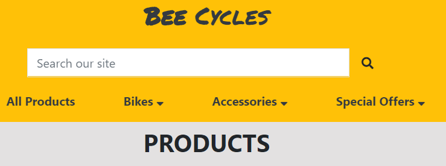
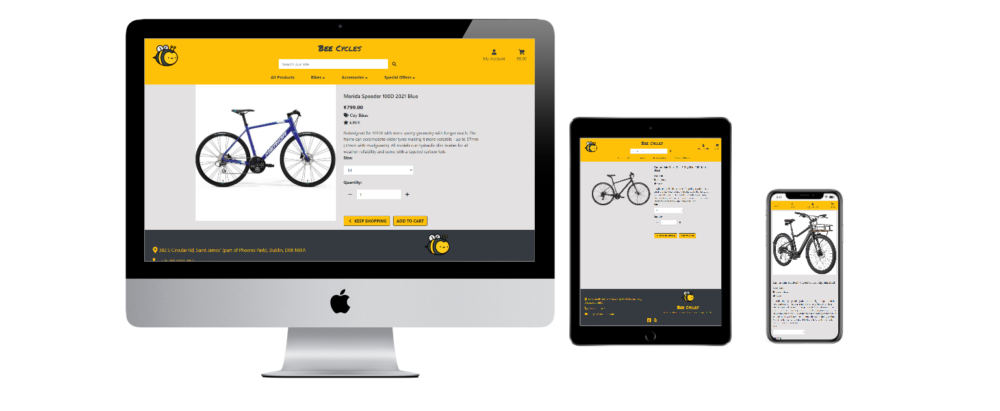

# Bee Cycles
## [Live Heroku App Link](https://bee-cycles.herokuapp.com/)
## [GitHub repository Link](https://github.com/todorr92/Bee-Cycles) 
#### Bee Cycles webshop was designed, built and deployed by Slobodan Todorovic as his final project for the Code Institute Full Stack Web Development diploma. The purpose of Bee Cycles online shop is to be the first website built for this shop. This website is designed to create a beautifully intuitive, smooth and effortless online shopping experience.
## Table of Contents
### 1. [UX](#ux)
### 2. [Features](#features)
### 3. [Information Architecture](#information-architecture)
### 4. [Technologies Used](#technologies-used)
### 5. [Testing](#testing)
### 6. [Deployment](#deployment)
### 7. [Credits](#credits)

## UX
### Goal
### User Stories
### As a Shopper
1. As a shopper I want to view list of products and services.
2. As a shopper I want to view product and service details so that I can identify price, description, product rating and product image.
3. As a shopper I want to easily view total of my purchases at any time.
4. As a shopper I want to sort the list of available products by best rated, price and categorically.
5. As a shopper I want to search for a product/service by name or description.
6. As a shopper I want to view items in my bag to be puchased.
7. As a shopper I want to adjust the quantity of individual items in my bag.
8. As a shopper I want to easily enter my payment information.
9. As a shopper I want to feel my personal and payment information is safe and secure.
10. As a shopper I want to view an order confirmation after checkout.
11. As a shopper I want to recieve an email confirmation after checking out.
### As a Site User
1. As a user I want to easily register for an account.
2. As a user I want to easily log in or out.
3. As a user I want to easily recover my password in case I forget it.
4. As a user I want to recieve and email confirmation after registering.
5. As a user I want to have a personalized user profile.
### As a Shop Owner
1. As a owner I want to add a product.
2. As a owner I want to edit a product.
3. As a owner I want to delete a product.

## Design Choices
### Font

+ Primary font 'Arial' was chosen for the main text of the site because of it clear readability, clean style and complementary contrast with the secondary font. This font also looks good in uppercase with a little extra letter spacing, and so could serve nicely as a sub heading as well.
+ The secondary font 'Permanent Marker' was chosen for the site name as it helps site name to stand out, but yet keep that simplicity.
### Icons
+ In order to keep the site uncluttered only a few icons were utilized.

+ The search icon, shopping cart and user icons were used in the navigation bar as they are conventionally used in this setting and would be what the user expects to see.
+ If the user is logged in as Admin, user icon is changing to njinja user icon

+ The Facebook and Yelp logo icon is included in the footer to lead visitors to Bee Cycles facebook and Yelp page.

+ Euro icon was used as currency, Tag icon was used for Category, star as a product rating, and some basic edit and delete icons.

+ Basic plus and minus icons were used for quantity.
### Colours

+ Orange: #FFC107
+ Smoky White: #E3E1E1
+ Dark Grey: #343A40
+ Black: #000000
+ Above colour palette was chosen based on owners chosen logo and catchy site name, so I've decided to keep everything in those colours.
### Styling
+ Curved cornes were applied on Buttons and Product cards.
+ Text shaddow and brightness were applied on Category cards on Home Page to make text more easier to read. 
### Wireframes
#### These wireframes were created using [Balsamiq](https://balsamiq.com/) during the Scope Plane part of the design and planning process for this project.
+ [Home](media/wireframes/Home.png)
+ [Products](media/wireframes/Products.png)
+ [Product Details](media/wireframes/)
+ [Shopping Bag](media/wireframes/Shopping-Bag.png)
+ [Checkout](media/wireframes/Checkout.png)
+ [Checkout Success](media/wireframes/)
+ [Profile](media/wireframes/Profile.png)
## Features
### Existing Features
#### Elements on every page
Navbar:

+ The navbar features on every page
+ The navigation bar features Bee Cycles logo on the far left, and site name Bee Cycles in the middle of the page which both links to the home page of the site.
+ In desktop view on the center of the navbar is a list of the product pages: All Products, Bikes, Accessories and Special Offers. All of the links apart of All Products are a dropdown menu which lists out the categories of shop products.
+ Beside navigation links, on desktop view a search bar is located just on the top of navigation links, searched word will be searched in both product name and description.
+ On the right side of the navbar are the links to shopping cart and dropdown on user icon.
+ A user who is currently logged out will also see options to register or log into the website.
+ A user who is logged in will see options to view their account page or log out.
+ Superuser or Admin will have additional option Product Managment where new product can be added.
+ The shopping cart icon is located to the far right of the navigation bar. Once a user has added at least one item to their cart a bold font will be applied to cart and amount for specific product or products.

+ In tablet and mobile view the logo and site name Bee Cycles are hidden, and Home link is added to burger menu.
+ The shopping cart icon is displayed at the right of the navigation bar, and the burger icon to display the full navigation menu is on the far left, with search bar and user icon in the middle of navigation bar because that is where a user would expect to find it.
Footer

+ The footer features on every page.
+ The footer background of dark grey and orange text was chosen to maintain same colour palette.
+ Location shown in footer is linked to Google Maps, email can be sent using default mail provider and telephone is just for information.
+ The footer also includes a link to Bee Cycle active social media channel on Facebook and Yelp. If/When Bee Cycles activates their other social medial channels on twitter/instagram/pinterest then these can be added to the icons in the footer.
#### Home Page
Hero slider/carousel
+ The home page hero slider/carousel features 3 slides of images from. All of them were selected randomly from online source. User testimonials are added at the bottom of carousel.
+ Below carousel some of the Bee Cycles characteristics are shown.
Shop Categories
 
+ Below the Bee Cycles characteristics are a selection of the shop categories, displayed with beautiful product photographs and clear headings. The user can click any of these images to be taken to the relevant sections of the shop. On hover there is some light zoom in action.
+ On desktop view these sections are displayed with 4 categories in one line as shown on image. On smaller screens each category is made as col-12.
New Arrivals/Deals listings
+ Two buttons, both connected with his product container, on click, one container is shown and second is hidden.
+ At the bottom of the home page 8 products are selected from the products database from those with product.category.name == 'new_arrivals' or product.category.name == 'deals in their properties.
#### Products Page
Category buttons
+ The main products page features a collection of buttons leading to each section of the shop, on click of the button, selected category will get active class. These buttons are not visible on mobile view to save space, instead of it one dropdown button was placed with all categories included and selected category will be selected as active and shown as dropdown text.
Sort
+ Just under category buttons on left side, cound of products was placed.
+ Just under category buttons on right side, sort selector is placed and includes the option to sort its results by "Price (low to high)", "Price (high to low)","Rating (low to high)" and "Rating (high to low)".
Products selection
+ Products in the shop are displayed as cards with images, their title, price, category and rating displayed underneath each image. If user is logged in as superuser Edit and Delete functions are appearing underneath rating.
+ Each product in the list has a link to it's respective product listing with more information.
#### Products Details Page

Product Image
+ While beeing on medium size screen, up to large and extra-large image is displayed on left side on the screen.
+ On mobile phone screens image is displayed first.
Product details
+ The product title, price, category, rating, edit-delete functions (if user is logged as superuser) and description are all clearly visible on the product listing page.
+ Under the product description is size dropdown selector if there is size applicable for product.
+ A quantity selector allows the user to select the quantity of a product they wish to purchase.
+ An "Keep shopping" and "Add to cart" buttons are displayed right under the quantity selection.
Notification messages
+ Whole notification messages are based on django message levels, for this specific project four levels were used: INFO, SUCCESS, WARNING and ERROR.
+ When a user adds an item to their cart, an Bootstrap toast success message appears with a green toast capper to inform them that their item has been successfully added and shows the user minified version of their cart, with information such as what action was done(Added ** product to your cart), cart summary, size(if selected), quantity and total price. They are then given the option to secure checkout in toast or they can just close it and continue their shopping.
+ Error message will appear with a red toast capper if any error occur on website, for example if empty search string is searched, toast error will appear with short details.
+ Toast for Info and Warning were created also and are pretty much same like error message, only one thing that is different is toast capper colour, for info is light blue and for warning is orange.
#### Register Page

+ A user who is not logged in can create a new account using the sign up page. The page on this form includes a username (which must be unique), email address, email address confirmation, password and password conformation fields.
#### Login Page

+ The login page features a standard login form asking for username and password with option to remember user.
+ In case user forgot password, they can retrieve it by clicking on Forgot Password? link, user should provide email, if email exists, recovery steps will bi sent to users email address.
#### Profile Page

+ The profile page is split in two sections:
 + Order Summary where user can see summary of all their previous orders.
 + Profile Info where user can update their phone number, street address, city, county, postal code and country.
#### Sign Out Page
+ Asking user if they are sure regarding loging out.
+ One button is there to cancel action and returns user to home page, second button is to confirm log out action and then returns user again to home page.
#### Product Managment Page
Add Product

+ Only admin or superuser can add product, once admin is logged in, Product Managment option comes up under user icon.
+ Admin then can add product, only name, description and price are required fields.
+ Once the product is added page is redirected to that specific product.
Edit Product

+ Only admin or superuser can edit product.
+ Admin can edit product, only name, description and price are required fields.
+ On the bottom small image of the product is shown so the Admin can see which one is uploaded.
#### Cart Page
Desktop

+ The shopping cart page features a summary of all the items the user has added to their cart.
+ On desktop view, image comes first, product name, size, sku, price, quantity and subtotal then follows.
+ With plus and minus simboles qunatity can adjust.
+ Edit link updates adjusted quantity.
+ Remove link deletes product from cart.
+ On the bottom of cart user can see cart total amount.
+ Keep Shopping button redirects user back to all products and secure checkout brings user to checkout page.
Mobile

+ Due to cart content beeing in table, scroll left-right appeared once testing on mobile.
+ To prevent that, content was spread in seperate html files and included then in cart.html.
+ Cart total comes first here, following by keep shopping and add to cart buttons.
+ Product details are then displayed as image on the left and product name, size and sku on the right.
+ Under product details, quantity input is displayed with plus and minus buttons, and on the right price for each product and total price were shown.
+ Edit link updates adjusted quantity.
+ Remove link deletes product from cart.
#### Checkout Page

+ Checkout is divided in three sections:
 + Order summary showing everything is pending payment.
 + Personal details such as email address and Full Name, and delivery details with option to save delivery information to users profile.
 + On the bottom there is input field for card payment validated by Stripe
+ Two buttons are also included, one is to Adjust Cart which brings user back to cart and second one is Complete Order to process payment.
+ Under buttons small red text is placed, notifying user how much credit card will be charged.
+ Once Complete Order is clicked form validation is done first, if everything is good to go, loading spinner shows up while payment is processing.
#### Checkout Success Page

+ Displayed is very simple order confirmation with order details, product ordered details, delivery and personal details and order total amount.
+ At the bottom button is shown, by clicking on it, user is redirected to New Arrivals, Deals and Clearence category products.
#### Django Email
+ In order to register on site, user needs to provide email address, in case user forgets password, by clicking on Forgot Password?(on Sign Up page) link and providing email address, user can recieve next step in password recovery.
+ Also once users checks out, orded confirmation is sent to user with all details.
+ For this all to work, gmail account was used and set it up with Django.
### Features to Implement
+ Coupons and discount codes.
    + Checkout page to include a field for customers to enter discount codes or coupons to adjust their final payment cost.
+ Newsletter.
    + Users would recieve an email with current deals, and depending on situation coupons or discount codes would be included.
+ Additional payment methods.
    + Implement Paypal.
+ Bike Services.
    + Bookin Bike repairs, bike maintenance classes and bike rentals.
+ Cycle To Work Scheme.
+ Implementing more categories.
    + Kids bikes, electric scooters, tools, clothing, footwear, nutrition and care.
## Information Architecture
### Database Choice
+ As a framework Django works with SQL databases. During development on my local machine I worked with the standard sqlite3 database installed with Django.
+ On deployment, the SQL database provided by Heroku is a PostgreSQL database.
### Data Models
#### User
+ The User model utilized for this project is the standard one provided by django.contrib.auth.models
#### Product app models
Category
Within the products app, the Category model holds all the data needed for the categories in the shop.
Name | Key in DB | Validation | Field Type
------------ | ------------- | ------------- | -------------
Name | name | max_length=254 | CharField
Friendly Name | friendly_name | max_length=254, null=True, blank=True | CharField 
Product
Within the products app, the Product model holds all the data needed for the products in the shop.
Name | Key in DB | Validation | Field Type
------------ | ------------- | ------------- | -------------
Category | category | 'Category', null=True, blank=True, on_delete=models.SET_NULL | ForeignKey
SKU | sku | max_length=254, null=True, blank=True | CharField
Name | name | max_length=254 | CharField
Description | description |  | TextField
Sizes | has_sizes | default=False, null=True, blank=True | BooleanField
Price | price | max_digits=6, decimal_places=2 | DecimalField
Rating | rating | max_digits=6, decimal_places=2, null=True, blank=True | DecimalField
Image URL | image_url | max_length=1024, null=True, blank=True | URLField
Image | image | null=True, blank=True | ImageField
#### Checkoutt app models
Within the checkout app, the Order and OrderLineItem models hold the data needed for users to create and pay for their orders.
Order
Name | Key in DB | Validation | Field Type
------------ | ------------- | ------------- | -------------
Order Number | order_number | max_length=32, null=False, editable=False | CharField
User Profile | user_profile | UserProfile, on_delete=models.SET_NULL, null=True, blank=True, related_name='orders' | ForeignKey
Full Name | full_name | max_length=50, null=False, blank=False | CharField
Email | email | max_length=254, null=False, blank=False | EmailField
Phone Number | phone_number | max_length=20, null=False, blank=False | CharField
Country | country | blank_label='Country *', null=False, blank=False | CountryField
Postcode | postcode | max_length=20, null=True, blank=True | CharField
City | city | max_length=40, null=False, blank=False | CharField
Street Address 1 | street_address1 | max_length=80, null=False, blank=False | CharField
Street Address 2 | street_address2 | max_length=80, null=True, blank=True | CharField
County | county | max_length=80, null=True, blank=True | CharField
Date | date | auto_now_add=True | DateTimeField
Order Total | order_total | max_digits=10, decimal_places=2, null=False, default=0 | DecimalField
Original Cart | original_cart | null=False, blank=False, default='' | TextField
Stripe PID | stripe_pid | max_length=254, null=False, blank=False, default='' | CharField
OrderLineItem
Name | Key in DB | Validation | Field Type
------------ | ------------- | ------------- | -------------
Order | order | Order, null=False, blank=False, on_delete=models.CASCADE, related_name='lineitems' | ForeignKey
Product | product | Product, null=False, blank=False, on_delete=models.CASCADE | ForeignKey
Product Size | product_size | max_length=2, null=True, blank=True | CharField
Quantity | quantity | null=False, blank=False, default=0 | IntegerField
Line Item Total | lineitem_total | max_digits=6, decimal_places=2, null=False, blank=False, editable=False | DecimalField
#### Profiles app models
UserProfile
Name | Key in DB | Validation | Field Type
------------ | ------------- | ------------- | -------------
User | user | User, on_delete=models.CASCADE | OneToOneField
Default Phone Number | default_phone_number | max_length=20, null=True, blank=True | CharField
Default Street Address 1 | default_street_address1 | max_length=80, null=True, blank=True | CharField
Default Street Address 2 | default_street_address2 | max_length=80, null=True, blank=True | CharField
Default City | default_city | max_length=40, null=True, blank=True | CharField
Default County | default_county | max_length=80, null=True, blank=True | CharField
Default Postcode | default_postcode | max_length=20, null=True, blank=True | CharField
Default Country | default_country | blank_label='Country', null=True, blank=True | CountryField
## Technologies Used
#### Tools
+ Gitpod as online IDE used for developing this project.
+ Django as python web framework for rapid development and clean design.
+ Stripe as payment platform to validate and accept credit card payments securely.
+ AWS S3 Bucket to store images entered into the database.
+ Boto3 to enable creation, configuration and management of AWS S3.
+ Django Crispy Forms to style django forms.
+ Django Storages a collection of custom storage backends with django to work with boto3 and AWS S3.
+ Django Allauth to handle register, log in, log out, password recovery actions.
+ Django Countries to handle country selection.
+ Gunicorn WSGI HTTP Server for UNIX to aid in deployment of the Django project to heroku.
+ Pillow as python imaging library to aid in processing image files to store in database.
+ Psycopg2 as PostgreSQL database adapter for Python.
+ PIP3 for installation of tools needed in this project.
+ Git to handle version control.
+ GitHub to store and share all project code remotely.
+ Balsamiq to create the wireframes for this project.
+ TinyPNG used to compress images.
+ [Mockup Generator](https://techsini.com/multi-mockup/index.php)
#### Databases
+ PostgreSQL for production database, provided by heroku.
+ SQlite3 for development database, provided by django.
#### Libraries
+ JQuery to simplify DOM manipulation.
+ Bootstrap to simplify the structure of the website and make the website responsive easily.
+ FontAwesome to provide icons for Bee Cycles webshop.
+ Google Fonts to style the website fonts.
#### Languages
+ This project uses HTML, CSS, JavaScript and Python programming languages.
## Testing
Testing information can be found in separate [TESTING.md](testing.md) file.
## Deployment
### Run this project locally
To run this project on your own IDE follow the instructions below:
+ Ensure you have the following tools: - An IDE such as [Visual Studio Code](https://code.visualstudio.com/)
+ The following must be installed on your machine: - [PIP](https://pip.pypa.io/en/stable/installing/) - [Python 3](https://www.python.org/downloads/) - [Git](https://gist.github.com/derhuerst/1b15ff4652a867391f03)
+ To allow you to access all functionality on the site locally, ensure you have created free accounts with the following services: - [Stripe](https://stripe.com/en-ie) - [AWS](https://aws.amazon.com/) and [set up an S3 bucket](https://docs.aws.amazon.com/AmazonS3/latest/gsg/CreatingABucket.html)
+ Please click the links above for documentation on how to set these up and retrieve the necessary environment variables.
#### Instructions
1. Save a copy of the github repository located at https://github.com/todorr92/Bee-Cycles by clicking the "download zip" button at the top of the page and extracting the zip file to your chosen folder. If you have Git installed on your system, you can clone the repository with the following command.
> "git clone https://github.com/todorr92/Bee-Cycles"
2. Open your preferred IDE, open a terminal session in the unzip folder or cd to the correct location.
3. A virtual environment is recommended for the Python interpreter, I recommend using Pythons built in virtual environment. Enter the command:
> "python -m .venv venv"
*NOTE: The python part of this command and the ones in other steps below assumes you are working with a windows operating system. Your Python command may differ, such as python3 or py*
4. Activate the .venv with the command:
> ".venv\Scripts\activate "
*Again this command may differ depending on your operating system, please check the [Python Documentation on virtual environments](https://docs.python.org/3/library/venv.html) for further instructions.*
5. If needed, Upgrade pip locally with:
> "pip install --upgrade pip"
6. Install all required modules with the command:
> "pip -r requirements.txt"
7. Set up the following environment variables within your IDE.
+ If using VSCode, locate the settings.json file within the .vscode directory and add your environment variables as below. Do not forget to restart your machine to activate your environment variables or your code will not be able to see them:
> "terminal.integrated.env.windows": {
>    "HOSTNAME": "<enter hostname here>",
>    "AWS_ACCESS_KEY_ID": "<enter key here>",
>    "AWS_SECRET_ACCESS_KEY": "<enter key here>",
>    "DATABASE_URL": "<enter key here>",
>    "EMAIL_HOST_PASS": "<enter key here>",
>    "EMAIL_HOST_USER": "<enter url here>",
>    "SECRET_KEY": "<enter url here>",
>    "STRIPE_PUBLIC_KEY": "<enter key here>",
>    "STRIPE_SECRET_KEY": "<enter key here>",
>    "STRIPE_WH_SECRET": "<enter key here>",
>    "USE_AWS": "True",
>    "AWS_STORAGE_BUCKET_NAME": "<enter bucket name here>"
> }
+ HOSTNAME should be the local address for the site when running within your own IDE.
8. If you have restarted your machine to activate your environment variables, do not forget to reactivate your virtual environment with the command used at step 4.
9. Migrate the admin panel models to create your database template with the terminal command:
> "python manage.py migrate" 
10. Create your superuser to access the django admin panel and database with the following command, and then follow the steps to add your admin username and password:
> "python manage.py migrate"
11. You can now run the program locally with the following command:
> "python manage.py runserver"
### Heroku Deployment
To deploy Bee Cycles webshop to heroku, take the following steps:
1. Create a requirements.txt file using the terminal command pip freeze > requirements.txt.
2. Create a Procfile and inside of it place this line of code:
> "web: gunicorn bee_cycles.wsgi:application"
3. **git add** and **git commit** the new requirements and Procfile and then git push the project to GitHub.
4. Create a new app on the [Heroku website](https://dashboard.heroku.com/apps/) by clicking the "New" button in your dashboard. Give it a name and set the region to whichever is applicable for your location.
5. From the heroku dashboard of your newly created application, click on "Deploy" > "Deployment method" and select GitHub.
6. Confirm the linking of the heroku app to the correct GitHub repository.
7. In the heroku dashboard for the application, click on "Settings" > "Reveal Config Vars".
8. Set the following config vars:
Key | Value 
------------ | ------------- 
AWS_ACCESS_KEY_ID | <your value> 
AWS_SECRET_ACCESS_KEY | <your value> 
DATABASE_URL | <your value> 
EMAIL_HOST_PASS | <your value> 
EMAIL_HOST_USER | <your value> 
SECRET_KEY | <your value> 
STRIPE_PUBLIC_KEY | <your value> 
STRIPE_SECRET_KEY | <your value> 
STRIPE_WH_SECRET | <your value>  
USE_AWS | <True> 
9. From the command line of your local IDE:
+ Enter the heroku postgres shell
+ Migrate the database models
+ Create your superuser account in your new database
Instructions on how to do these steps can be found in the [heroku devcenter documentation](https://devcenter.heroku.com/articles/heroku-postgresql).
10. In your heroku dashboard, click "Deploy". Scroll down to "Manual Deploy", select the master branch then click "Deploy Branch".
11. Once the build is complete, click the "View app" button provided and site should run as expected.
## Credits
### Content
+ All product images and description provided by [360 Cycles](https://www.360cycles.ie/)
### Images
+ Images on home page and logo taken from [Pexels](https://www.pexels.com/), [FreeImages](https://www.freeimages.com/) and [Pixabay](https://pixabay.com/).
### Code
+ [Boutique Ado](https://todorr92-boutique-ado.herokuapp.com/)
+ The following youtube video series provided much explanation about the use and operation of Django.
 + [Python Django Web Framework - Full Course for Beginners by freeCodeCamp.org](https://www.youtube.com/watch?v=F5mRW0jo-U4)
 + [Django Tutorials by Corey Schafer](https://www.youtube.com/watch?v=UmljXZIypDc&list=PL-osiE80TeTtoQCKZ03TU5fNfx2UY6U4p)
+ Other helpful resources were [w3schools.com](https://www.w3schools.com/), [CSS Gradient](https://cssgradient.io/), [Stack Overflow](https://stackoverflow.com/), [Material Design](https://material.io/design), [MDN web docs](https://developer.mozilla.org/en-US/), [Stack Abuse](https://stackabuse.com/) and [CSS Tricks](https://css-tricks.com/).
## Acknowledgements
Special thanks to my mentor [Akshat Garg](https://github.com/akshatnitd) for his time and expertise through my entire journey through the CodeInstitute full stack web development course.
With thanks also to my many coding collagues on Slack community.
## Disclaimer
#### Please note that content on this website is educational purpose only.

