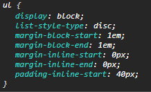

# Bee Cycles - Testing details

### [README.md](readme.md)
### [Bee Cycles](https://bee-cycles.herokuapp.com/)
## Table of Contents
1. [User Stories Testing](#user-stories-testing)
2. [Manual Testing](#manual-testing)
3. [Code Validation](#code-validation)
4. [Browser Testing](#browser-testing)
5. [Bugs Discovered](#bugs-discovered)
6. [Further Testing](#further-testing)

## Code Validation
### [Autoprefixer](https://autoprefixer.github.io/)
+ Added prefixes to CSS for different browsers.
### [CSS Validator](https://jigsaw.w3.org/css-validator/)
+ Couple of errors showed on base.css.

+ Errors appeared because I wanted to override default `ul` styling as shown on image.

+ Also couple of warnings were shown but all of them were due to prefix vendors.
### [CSS Formatter](https://www.cleancss.com/css-beautify/)
+ Formatted base.css.
### [HTML Validator](https://validator.w3.org/nu/)
#### Home Page
+ Had a few errors due to `li` item being direct child of `nav` element.

+ Fixed that by wrapping `li` elements in one `ul` element and added custom css styling.

#### Products Page

+ Had a two warnings regarding script type.

+ Fixed that by removing script type from code.
#### Product Details Page

+ Only one warning regarding script type.

+ Fixed that by removing script type from code.
#### Cart Page

+ One warning regarding script type.

+ Fixed that by removing script type from code.
#### Checkout Page

+ No errors there.

+ No errors on checkout-success page.
#### Add/Edit Page

+ No errors here.
#### Profile Page

+ No errors.
#### Sign Up/Login Page

+ No errors.